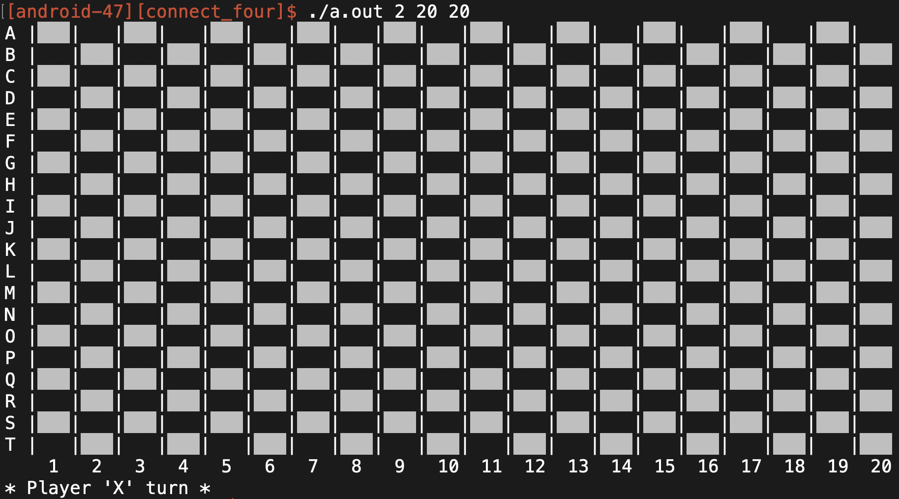
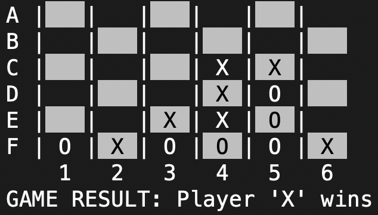

# Connect Four

By Javier Garcia Ramirez (android-47)
Sat. Mar 27, 2021

## GAMEPLAY
### Board as a 20x20 Grid

### Diagonal Connection


### DESCRIPTION
This is a program that allows the user(s) to play Connect Four in 1 player mode against the computer, where the user decides who goes 
first, or 2 player mode, where two humans can play against each other. The pieces used in this game to represent the two players are 
"X"'s and "O"'s. The first player to connect four adjacent pieces (horizontally, vertically, or diagonally) wins. At the end of each 
game, the user can play again or quit the game. When the user runs the program, the user enters command line arguments to indicate 
the number of players as well as the board dimensions, columns and rows must be between 4-20, inclusively. The board is updated and 
displayed at the end of each player's turn.

### STEPS ON HOW TO COMPILE AND RUN THE PROGRAM
1. Compile the program using C++ 11 by entering the following into the terminal command line  

```
g++ -std=c++11 connect_four.cpp
```

2. Run the program by running the executable file along with command line arguments in the following order: number of 
   players, number of rows, number of columns. Players can be either 1 or 2, rows and columns have to be between 1-20. 
   For example, if the following line is entered into the terminal command line, it will be a 2 player game with 15 rows and 20 columns  

```
./a.out 2 15 20
```

### KNOWN LIMITATIONS
* In 1 player mode. The computer makes decisions very quickly, so it may be hard to notice the computer's move but by looking at the board from the end of the previous turn, it should clear up anything that may not be clear.